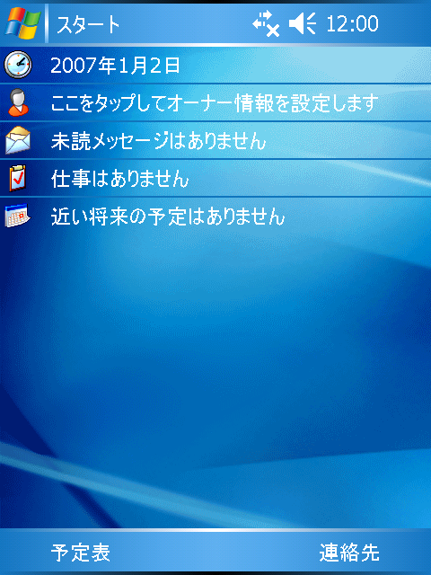

# CErulean

[日本語](README.md) | **English**

An emulator that runs Windows Mobile 5.0 / 6 in your browser.
You can operate it with taps and keys, and install supported apps.

**[Use the GitHub Pages version](https://mikuta0407.github.io/CErulean/)**



**No OS images are bundled.** Prepare one by following the [download, extraction and terms of use guide](docs/images.en.md), then select it in the browser.

To use the internet from inside Windows Mobile, a separate [relay server](docs/usage.en.md#using-the-internet) is required.

## Self-hosting

Download and extract the prebuilt binary for your environment from [Releases](https://github.com/mikuta0407/CErulean/releases).
Run it in the folder that contains `cerulean`.

```sh
./cerulean serve
```

On Windows, use `cerulean.exe` and run `./cerulean.exe serve` in PowerShell.
If you lack execute permission, run `chmod +x cerulean`.
Keep the terminal running the server open. Press Ctrl+C to stop it.

1. Open <http://127.0.0.1:8000/app/> in your browser.
2. Select the `.bin` you prepared following the [extraction guide](docs/images.en.md). You can leave the screen size on "Auto".
3. Wait for the Today screen, then operate it with taps, drags, arrow keys and Enter.
   Turn off your IME when typing alphanumerics on a PC.

### Basic usage

- **Save / resume:** State is saved automatically, and you can "Resume" next time. Manual save and export are available from the menu.
- **Sound:** Turn it on with "Play sound" in the menu (only at normal speed).
- **Storage card:** Create a card from "Storage card" in the menu, eject it, add files, and insert it again.
  In File Explorer, open a supported `.cab` to install it, or run an `.exe`.
- **Switching environments:** Use profiles on the start screen to keep separate images and saved states.
- **Offline:** Adding to the home screen (PWA) is supported. Environments that have already been loaded also work offline.

Data is stored in the browser. Clearing site data also deletes your saves.
**Exported snapshots contain the contents of the OS, so do not share them publicly.**

### Using the internet

A relay server is required to connect to the internet from inside Windows Mobile.
The following command starts the browser app and the relay server together.

```sh
./cerulean serve --with-relay
```

1. Open the URL with a token that is shown at startup in your browser.
2. Start Windows Mobile, and turn on "Network (via relay server)" in the CErulean menu.
3. In Windows Mobile, go to "Settings → Connections → Network Card" and set the destination to "The Internet".
4. Open a website in Internet Explorer on Windows Mobile.
   To use HTTPS sites, first open `http://10.0.2.2/` and install the CErulean Local CA certificate.

To use a different relay server, specify its URL and token in the menu.
From an HTTPS page, use `wss://` (`ws://127.0.0.1` for a local relay).

### Using on a smartphone

Open the served CErulean in your browser.
Save the extracted `.bin` on the smartphone and select it on that device.

On iOS, performance may be slow unless the page is opened over HTTPS.

### Server options

| Option | Purpose |
|---|---|
| `--port 8080` | Change the port (default `127.0.0.1:8000`) |
| `--listen 0.0.0.0:8080` | Change the listen address and port |
| `--with-relay` | Start the network relay |
| `--token TOKEN` | Fix the relay token (generated automatically if omitted) |
| `--allow-private` | Allow the relay to connect to the LAN and localhost |
| `--root DIR` | Serve external web assets instead of the embedded ones |

To use it from other devices, serve it through an HTTPS reverse proxy.

## Building and hosting

### Build from source

Prepare rustup, a C compiler and Node.js, and run the following at the repository root (use Bash on WSL for Windows).

```sh
cargo install wasm-bindgen-cli --version 0.2.129 --locked
bash tools/build.sh
target/release/cerulean serve
```

### Put it on a static web server

```sh
./cerulean web-export site
```

Place the contents of `site/` as-is on an HTTPS web server and open `/app/`.
Serve `.wasm` as `application/wasm`. Users select the OS image locally.
**If the guest does not need network access, neither the relay server nor a resident CErulean process is required.**

## Features

- Boot and operate supported WM5 / WM6 images
- Use the standard apps and install supported additional apps
- Save / resume, sound, storage cards
- PWA and offline startup, internet access via a relay

## Limitations

- Real-device ROMs, Windows Phone and desktop Windows are out of scope
- Calls, SMS and cellular connections are not supported
- No guarantee that every app or peripheral works

## TODO

- Hardware soft key and power button input
- Improved CPU and peripheral compatibility
- A native interactive UI

## More information

- [Usage and hosting](docs/usage.en.md)
- [Obtaining and extracting images, and terms of use](docs/images.en.md)

## License

Code, documents and bundled icons are under the [MIT License](LICENSE).
OS images and SDKs are subject to [separate Microsoft terms](docs/images.en.md).
